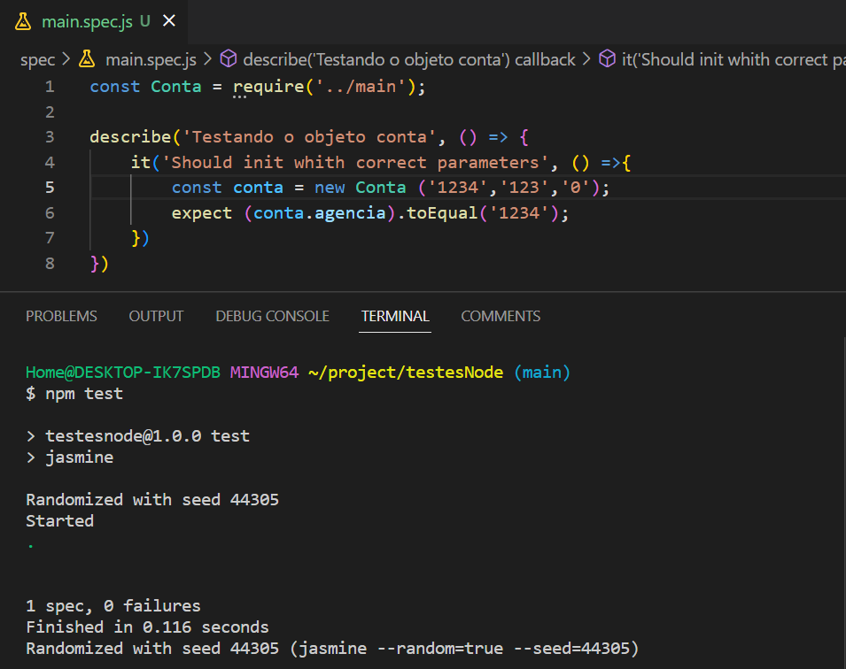

[](https://portfolio-nadi.vercel.app/)
[](https://twitter.com/nadiduno)
[](https://www.linkedin.com/in/nadiduno/)
<br />
<br />


# testNode
Implementando Jasmine no JavaScript para fazer teste unitários

```bash
# Install the dependencies
$ npm i jasmine -D

# Initialize 
$ npx  jasmine init

# Run test
$ npm test
```


<div align="center">
  
  <br />
</div>

<div align="center">
  
  <br />
</div>

[@nadiduno](https://www.instagram.com/nadiduno.csv/)
<br />
[@willgmbr](https://twitter.com/willgmbr) - Mentor do programa Google Developer Up - 
